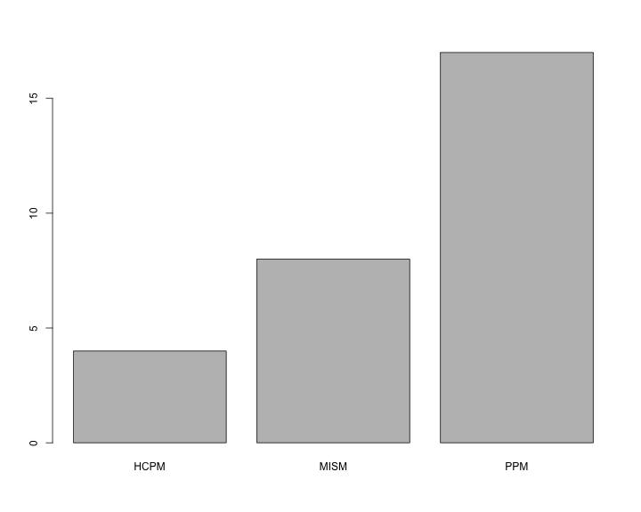
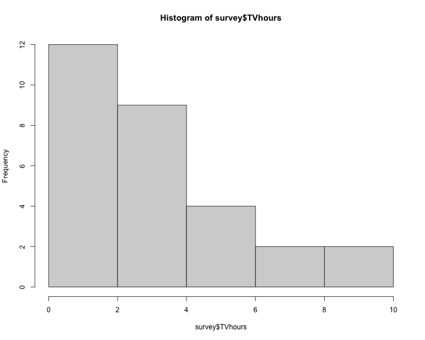

<style>
  .reveal pre {
    font-size: 13pt;
  }
  .reveal section p {
    font-size: 32pt;
  }
  .reveal div {
    font-size: 30pt;
  }
  .reveal h3 {
    color: #484848;
    font-weight: 150%;
  }
</style>

Lecture 2: Importing data and more basics
====
author: 94-842
date: October 23, 2014
font-family: Garamond
autosize: false
width:1440
height:900

Agenda
====

- Live demo of RStudio and R Markdown

- Importing data

- Simple summaries of categorical and continuous data

- Coding style

- Homework 1 assigned, grading rubric

- Lab 2

Live demo
====
1. Starting an R Markdown (Rmd) file

2. Knitting to HTML

3. Editing code chunks

4. Sending code to the console

Importing data
====

- Start with survey results from "Homework 0"

- To import tabular data into R, we use the **`read.table()`** command


```r
survey <- read.table("http://www.andrew.cmu.edu/user/achoulde/94842/data/survey_data.csv", header=TRUE, sep=",")
```

- Let's parse this command one component at a time
  - The data is in a file called `survey_data.csv`, which is an online file
  - The file contains a `header` as its first row
  - The csv format means that the data is comma-separated, so `sep=","`

- Could've also used `read.csv()`, which is just `read.table()` with the preset `sep=","`

Exploring the data
====
- R imports data into a **`data.frame`** object

```r
class(survey)
```

```
[1] "data.frame"
```

- To view the first few rows of the data, use **`head()`**

```r
head(survey)
```

```
           Rexperience OperatingSystem TVhours         Editor Program
1           Never used         Windows     3.0 Microsoft Word     PPM
2           Never used         Windows     4.0 Microsoft Word    HCPM
3 Installed on machine         Windows     2.5 Microsoft Word     PPM
4     Basic competence        Mac OS X     2.0 Microsoft Word     PPM
5     Basic competence        Mac OS X     0.0 Microsoft Word     PPM
6           Never used         Windows     1.0 Microsoft Word    MISM
```

- `head(data.frame,n)` returns the first `n` rows of the data frame

- In the Console, you can also use **`View(survey)`** to get a spreadsheet view

Simple summary
====
- Use the `str()` function to get a simple summary of your data set


```r
str(survey)
```

```
'data.frame':	29 obs. of  5 variables:
 $ Rexperience    : Factor w/ 3 levels "Basic competence",..: 3 3 2 1 1 3 3 2 3 2 ...
 $ OperatingSystem: Factor w/ 2 levels "Mac OS X","Windows": 2 2 2 1 1 2 2 2 2 1 ...
 $ TVhours        : num  3 4 2.5 2 0 1 3 4 0 3 ...
 $ Editor         : Factor w/ 2 levels "LaTeX","Microsoft Word": 2 2 2 2 2 2 2 2 2 2 ...
 $ Program        : Factor w/ 3 levels "HCPM","MISM",..: 3 1 3 3 3 2 3 3 2 3 ...
```
<br>

- This says that TVhours is a numeric variable, while all the rest are factors (categorical)

Another simple summary
====


```r
summary(survey)
```

```
               Rexperience OperatingSystem    TVhours      
 Basic competence    : 3   Mac OS X: 8     Min.   : 0.000  
 Installed on machine: 9   Windows :21     1st Qu.: 0.000  
 Never used          :17                   Median : 3.000  
                                           Mean   : 3.121  
                                           3rd Qu.: 5.000  
                                           Max.   :10.000  
            Editor   Program  
 LaTeX         : 1   HCPM: 4  
 Microsoft Word:28   MISM: 8  
                     PPM :17  
                              
                              
                              
```

Data frame basics
====

- We will talk more about lists and data frames next week, so only give an intro here

- To see what an R object is made up of, you can use `attributes()`


```r
attributes(survey)
```

```
$names
[1] "Rexperience"     "OperatingSystem" "TVhours"         "Editor"         
[5] "Program"        

$class
[1] "data.frame"

$row.names
 [1]  1  2  3  4  5  6  7  8  9 10 11 12 13 14 15 16 17 18 19 20 21 22 23
[24] 24 25 26 27 28 29
```

> An R **data frame** is a *list* whose columns you can refer to by *name* or *index*

Data frame dimensions
====
- We can use `nrow()` and `ncol` to determine the number of survey responses and the number of survey questions

```r
nrow(survey) # Number of rows (responses)
```

```
[1] 29
```

```r
ncol(survey) # Number of columns (questions)
```

```
[1] 5
```
- When writing reports, you will often want to say how large your sample size was
- To do this *inline*, use the syntax:

```r
`r nrow(survey)`
```
- This allows us to write "29 students responded to the survey", and have the number displayed
  automatically change when `nrow(survey)` changes.

Inline code chunks example
====

- Here's a more complex example of inline code use.


```r
We collected data on `r ncol(survey)` survey questions from `r nrow(survey)` respondents.  Respondents represented `r length(unique(survey[["Program"]]))` Heinz College programs.  `r sum(survey[["Program"]] == "PPM")` of the repondents were from PPM.
```

- Which results in

> We collected data on 5 survey questions from 29 respondents.  Respondents represented 3 Heinz College programs.  17 of the repondents were from PPM.

<br>
- **IMPORTANT**: You are expected to use inline code chunks instead of copying and pasting output whenever possible.

Indexing data frames
====

- There are many different ways of indexing the same piece of a data frame

```r
survey[["Program"]]  # "Program" element
```

```
 [1] PPM  HCPM PPM  PPM  PPM  MISM PPM  PPM  MISM PPM  PPM  PPM  PPM  PPM 
[15] PPM  HCPM MISM PPM  PPM  HCPM PPM  MISM MISM MISM MISM PPM  HCPM PPM 
[29] MISM
Levels: HCPM MISM PPM
```

```r
survey$Program # "Program" element
```

```
 [1] PPM  HCPM PPM  PPM  PPM  MISM PPM  PPM  MISM PPM  PPM  PPM  PPM  PPM 
[15] PPM  HCPM MISM PPM  PPM  HCPM PPM  MISM MISM MISM MISM PPM  HCPM PPM 
[29] MISM
Levels: HCPM MISM PPM
```

```r
survey[,5] # Data from 5th column
```

```
 [1] PPM  HCPM PPM  PPM  PPM  MISM PPM  PPM  MISM PPM  PPM  PPM  PPM  PPM 
[15] PPM  HCPM MISM PPM  PPM  HCPM PPM  MISM MISM MISM MISM PPM  HCPM PPM 
[29] MISM
Levels: HCPM MISM PPM
```

More indexing
====
- Note that single brackets and double brackets have different effects

```r
survey[["Program"]]
```

```
 [1] PPM  HCPM PPM  PPM  PPM  MISM PPM  PPM  MISM PPM  PPM  PPM  PPM  PPM 
[15] PPM  HCPM MISM PPM  PPM  HCPM PPM  MISM MISM MISM MISM PPM  HCPM PPM 
[29] MISM
Levels: HCPM MISM PPM
```

```r
survey["Program"] # sub-data frame containing only "Program"
```

```
   Program
1      PPM
2     HCPM
3      PPM
4      PPM
5      PPM
6     MISM
7      PPM
8      PPM
9     MISM
10     PPM
11     PPM
12     PPM
13     PPM
14     PPM
15     PPM
16    HCPM
17    MISM
18     PPM
19     PPM
20    HCPM
21     PPM
22    MISM
23    MISM
24    MISM
25    MISM
26     PPM
27    HCPM
28     PPM
29    MISM
```


Bar plot (categorical data)
====
<center>

```r
  plot(survey[["Program"]])
```

 
</center>

Histogram (continuous data)
====
<center>

```r
  hist(survey$TVhours, col="lightgray")
```

 
</center>

Indexing multiple columns
====


```r
head(survey[,c(4,5)]) # Data from 4th and 5th columns
```

```
          Editor Program
1 Microsoft Word     PPM
2 Microsoft Word    HCPM
3 Microsoft Word     PPM
4 Microsoft Word     PPM
5 Microsoft Word     PPM
6 Microsoft Word    MISM
```

```r
head(survey[c("Editor", "Program")]) # Data from "Editor" and "Program"
```

```
          Editor Program
1 Microsoft Word     PPM
2 Microsoft Word    HCPM
3 Microsoft Word     PPM
4 Microsoft Word     PPM
5 Microsoft Word     PPM
6 Microsoft Word    MISM
```

Indexing rows and columns
====
- Data frames have two dimensions to index across


```r
survey[6,] # 6th row
```

```
  Rexperience OperatingSystem TVhours         Editor Program
6  Never used         Windows       1 Microsoft Word    MISM
```

```r
survey[6,5] # row 6, column 5
```

```
[1] MISM
Levels: HCPM MISM PPM
```

```r
survey[6, "Program"] # Program of 5th survey respondent
```

```
[1] MISM
Levels: HCPM MISM PPM
```

```r
survey[["Program"]][6]
```

```
[1] MISM
Levels: HCPM MISM PPM
```

More indexing
====
- In Lab 1, you were introduced to the colon operator `:`

- We can use this operator for indexing


```r
survey[1:5,]  # equivalent to head(survey, 5)
```

```
           Rexperience OperatingSystem TVhours         Editor Program
1           Never used         Windows     3.0 Microsoft Word     PPM
2           Never used         Windows     4.0 Microsoft Word    HCPM
3 Installed on machine         Windows     2.5 Microsoft Word     PPM
4     Basic competence        Mac OS X     2.0 Microsoft Word     PPM
5     Basic competence        Mac OS X     0.0 Microsoft Word     PPM
```

```r
survey[3:5, c(1,5)]
```

```
           Rexperience Program
3 Installed on machine     PPM
4     Basic competence     PPM
5     Basic competence     PPM
```

Subsets of data
====

- We are often interested in learning something a specific subset of the data


```r
survey[survey$Program=="MISM",] # Data from the MISM students
```

```
            Rexperience OperatingSystem TVhours         Editor Program
6            Never used         Windows       1 Microsoft Word    MISM
9            Never used         Windows       0 Microsoft Word    MISM
17           Never used         Windows       5 Microsoft Word    MISM
22           Never used        Mac OS X       0 Microsoft Word    MISM
23           Never used         Windows       0 Microsoft Word    MISM
24           Never used         Windows       3 Microsoft Word    MISM
25 Installed on machine         Windows       0 Microsoft Word    MISM
29 Installed on machine         Windows       0 Microsoft Word    MISM
```

```r
survey[which(survey$Program=="MISM"),] # Does the same thing
```

```
            Rexperience OperatingSystem TVhours         Editor Program
6            Never used         Windows       1 Microsoft Word    MISM
9            Never used         Windows       0 Microsoft Word    MISM
17           Never used         Windows       5 Microsoft Word    MISM
22           Never used        Mac OS X       0 Microsoft Word    MISM
23           Never used         Windows       0 Microsoft Word    MISM
24           Never used         Windows       3 Microsoft Word    MISM
25 Installed on machine         Windows       0 Microsoft Word    MISM
29 Installed on machine         Windows       0 Microsoft Word    MISM
```

More subset examples
====

- Let's pull all of the PPM students who have never used R before


```r
survey[survey$Program=="PPM" & survey$Rexperience=="Never used",]
```

```
   Rexperience OperatingSystem TVhours         Editor Program
1   Never used         Windows       3 Microsoft Word     PPM
7   Never used         Windows       3 Microsoft Word     PPM
11  Never used         Windows       7 Microsoft Word     PPM
13  Never used        Mac OS X       5 Microsoft Word     PPM
15  Never used         Windows       8 Microsoft Word     PPM
18  Never used         Windows       3 Microsoft Word     PPM
19  Never used        Mac OS X       3 Microsoft Word     PPM
21  Never used         Windows       5 Microsoft Word     PPM
26  Never used         Windows       2 Microsoft Word     PPM
```

Cleaner subsetting
====

- When the subset conditions get long or messy, it is preferable to use the **`subset()`** function

- Here's an example of selecting the OperatingSystem and TVhours responses from all of the students who are either in PPM or HCPM and who listed their R experience as "Installed in machine".


```r
subset(survey, select=c("OperatingSystem", "TVhours"), subset=(Program == "PPM" | Program == "HCPM") & Rexperience == "Installed on machine")
```

```
   OperatingSystem TVhours
3          Windows     2.5
8          Windows     4.0
10        Mac OS X     3.0
12         Windows     0.0
14         Windows     6.0
27         Windows    10.0
28        Mac OS X     1.0
```

Some simple calculations
====


```r
mean(survey$TVhours[survey$Program == "PPM"]) # Average time PPM's spent watching TV
```

```
[1] 3.382353
```

```r
mean(survey$TVhours[survey$Program == "MISM"]) # Average time MISM's spent watching TV
```

```
[1] 1.125
```

```r
mean(survey$TVhours[survey$Program == "HCPM"]) # Average time HCPM's spent watching TV
```

```
[1] 6
```

- Later on we'll learn a better way of doing these types of calculations by using the **aggregate()** function.

Defining variables
====

- If we wanted to focus on a particular column of the data frame, we could always define it as a new variable


```r
tv.hours <- survey$TVhours
mean(tv.hours)
```

```
[1] 3.12069
```

```r
sd(tv.hours)
```

```
[1] 2.950954
```

```r
tv.hours >= 5
```

```
 [1] FALSE FALSE FALSE FALSE FALSE FALSE FALSE FALSE FALSE FALSE  TRUE
[12] FALSE  TRUE  TRUE  TRUE FALSE  TRUE FALSE FALSE  TRUE  TRUE FALSE
[23] FALSE FALSE FALSE FALSE  TRUE FALSE FALSE
```

```r
sum(tv.hours >= 5)
```

```
[1] 8
```

R coding style
====

- Coding style (and code commenting) will become increasingly more important as we get into more advanced and involved programming tasks

- A few R "style guides" exist:
    - [Google's](https://google-styleguide.googlecode.com/svn/trunk/Rguide.xml)
    - [Hadley Wickham's](http://r-pkgs.had.co.nz/style.html)

- Borrowing Hadley Wickham's words:
> You don’t have to use my style, but you really should use a **consistent** style.

R style recommendations
====

- [Hadley Wickham's](http://r-pkgs.had.co.nz/style.html) guide is short and easy to follow

- The [`formatR`](http://yihui.name/formatR/) package can be used to automatically tidy up messy source code

- We'll revisit the question of coding style several times over the course of the class

Enforced style: Assignment operator
====

**Assignment operator**.  USE **`<-`**


```r
student.names <- c("Eric", "Hao", "Jennifer")  # Good
student.names = c("Eric", "Hao", "Jennifer") # Bad
```

- Note: When specifying function arguments, only `=` is valid


```r
sort(tv.hours, decreasing=TRUE) # Good
sort(tv.hours, decreasing<-TRUE) # Bad!!
```

Enforced style: Spacing
====

- Binary operators should have spaces around them

- Commas should have a space after, but not before (just like in writing)


```r
3 * 4 # Good
3*4 # Bad
which(student.names == "Eric") # Good
which(student.names=="Eric") # Bad
```

- For specifying arguments, spacing around `=` is optional


```r
sort(tv.hours, decreasing=TRUE) # Accepted
sort(tv.hours, decreasing = FALSE) # Accepted
```

Enforced style: Variable names
====

- To make code easy to read, debug, and maintain, you should use **concise** but **descriptive** variable names

- Terms in variable names should be separated by `_` or `.`


```r
# Accepted
day_one   day.one   day_1   day.1   day1

# Bad
d1   DayOne   dayone

# Can be made more concise:
first.day.of.the.month
```

- Avoid using variable names that are already pre-defined in R

```r
# EXTREMELY bad:
c   T   pi   sum   mean
```

Assignments
====

- **Homework 1** has been posted to the course website
  - **Due: Thursday, October 30, 4:30pm**
  - Submit your .Rmd file on Blackboard
  - Course website contains grading rubric

- **Lab 2** has been posted to the course website
  - Submit your .Rmd file on Blackboard by **11:59pm tonight**
  - Remember: You'll earn 1 full participation point for submitting an Rmd file even if you've made no progress on the lab.
