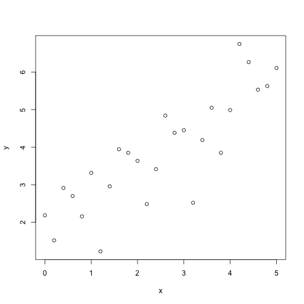

A Gentle Introduction to Bayesian Inference
========================================================
author: Daniel Marcelio
date: 01/09/2013

Introduction
========================================================
Imagine we are repeatedly tossing a coin. We can think of the outcome of this coin toss as a Bernoulli process, with the probability that the coin will come up ``heads'' (success) given by

$$p(success) \sim Bern(\theta)$$

where  $\theta$ is the rate parameter, which means that we are modelling each individual trial.

Alternatively, we can consider $N$ trials, and model the probability of obtaining \( k \) successful trials out of $N$, in which case we need a binomal distribution:

$$p(k) \sim Bin(\theta, N)$$.


Simulation
========================================================
Let's simulate throwing this coin *20* times (a lot faster than actually tossing the coin). FOr this example, we will use a fair coin, which means that the rate parameter $\theta$ should be  *0.5*:


```r
N <- 20
theta <- 0.5
k = rbinom(n = 1, size = N, prob = theta)
k
```

```
[1] 13
```

We have obtained 13 successes out of 20 tosses.


Inferring the rate from observed data
========================================================
Now suppose that we are told that a given coin has produced 13 successes out of 20 tosses. How should we go about inferring the rate parameter, given our observations?
The intuitive answer is, of course, to calculate the relative frequency: $k/N$, which gives us an estimate of 0.65.

We will see later that this corresponds to a special case of inference (also maximum likelihood estimate).


Short digression
========================================================
At this point you might be asking yourself: what's the big deal deal with coins? Isn't this all rather trivial? It might help to consider a coin toss as a simple metaphor for any process that generates binary responses.

A very important application would be a participant producing binary responses in a 2-alternative choice experiment. The  $k$  choices are out of  $N$  trials are distributed as  $Bin(\theta, N)$,  and  $\theta$  is a parameter that we want to infer from the participants choices.


Short digression
========================================================

The process currently under consideration models the choice behaviour as simply being generated by a rate, without considering any experimental manipulations. This correpsonds to inferring the participant's bias.

By thinking about it this way, we will be able to build a model of the participants behaviour, and the deep connection to generalized linear models will become clear. In case, we are building a linear model (with just an intercept), and, using GLM terminology, we are assuming a logit link function. Thus, this correpsonds to logistic regression.


Inferring the rate from observed data
========================================================

Using Bayes theorem, we can write an equation for the conditional probability of the rate  $\theta$, given our observed data, which we denote  $D$:

$$P(\theta | D) = \frac{P(D|\theta) * P(\theta)}{\int P(D | \theta) * P(\theta) \ \mathrm{d}\theta}$$

We can solve this analytically, but we will do that later. For now, we are only considering computation approaches. Unfortunately, however, integrals look rather scary to non-mathematicians, and it would be nice if we could just close our eyes and make them go away.


MCMC sampling
========================================================
The good news is that this is precisely what we can do, by using Markov Chain Monte Carlo sampling. We will explore what this means later. At the moment, it will suffice to consider it as magic that will allow us to ignore the denominator, and write:

$$P(\theta | D) \propto P(D|\theta) * P(\theta)$$

What this means is that we will infer the rate  $\theta$  by considering the data, given by $P(D|\theta)$, and the prior probability of $\theta$, given by $P(\theta)$.

The data distribution $P(D|\theta)$ is referred to as the Likelihood function, in which case it is a function of $\theta$ for the observed data, and is not a probability distribution.


Inferring a binomial rate using jags
========================================================

Let's generate some more data, this time using an unfair coin:


```r
N <- 20
theta <- 0.75
k = rbinom(n = 1, size = N, prob = theta)
k
```

```
[1] 14
```

This time, have obtained 14 successes out of 20 tosses, but we know that the coin is unfair. Now let's try to infer the probability of the coin having a certain rate, given the observed data.


Inferring a binomial rate using jags
========================================================

All we need to do for now is think about our prior distribution for the coin's rate; without any specific knowledge of the coin, we have no reason to assume that the coin has any particular bias. Normally, coins should be more or less fair, which means we have a prior that  $\theta = 0.5$,  but actually,  $\theta$  shouldn't be exaclty 0.5, because that would imply that the coin is manufactured with amazing precision. In other words, we expect even a fair coin to have range of possible rates.

Is seems sensible, for the moment, to assume that any value betewen  $0$ and  $1$ is possible, so we will use a uniform prior over the interval [0,1].


Prior probabibility distribution
========================================================

A uniform prior can be written as:

$$P(\theta) ~ Unif(0, 1)$$

but we can also write:

$$P(\theta) ~ Beta(1, 1)$$

where the two parameters of the Beta distribution,  $a$  and  $b$, can be understood as the prior successes and failures. Therefore, setting both  $a$  and  $b$ to  $1$  means that our prior says we have observed 2 coin tosses, with 1 success and 1 failure.


What do we need for computing?
========================================================

Load libraries


```r
library(R2jags)
library(ggmcmc)
```


Using jags: model
========================================================

First, we wil specify our model in jags code:


```r
model.jags <- "
model {

    # prior distribution for theta
    theta ~ dbeta(1, 1)

    # likelihood function (observed data)
    k ~ dbin(theta, n)
}
"
```


Using jags: data
========================================================

Next, we need to tell jags where to find the data, and jags will infer from this which variables in the model, are observed, and which are hidden:


```r
data.jags <- list (n = N,
                   k = k)
```


Using jags: initial values
========================================================


```r
inits.jags <- function(){
    list(theta = runif(n = 1,
                       min = 0,
                       max = 1))
}
```


Using jags: parameters to be monitored
========================================================

Now, we can tell jags which parameters we are interested in. Jags will then return the samples from the posterior distribution for those parameters.

In this case, we only have one parameter,  $\theta$:


```r
parameters = c("theta")
```


Using jags: calling jags
========================================================


```r
samples = jags(data = data.jags,
               inits = inits.jags,
               parameters.to.save = parameters,
               model.file = textConnection(model.jags),
               n.chains = 1,
               n.iter = 1000,
               n.burnin = 100,
               n.thin = 3,
               DIC = T)
```


Using jags: output
========================================================

```r
samples
Inference for Bugs model at "5", fit using jags,
 1 chains, each with 1000 iterations (first 100 discarded), n.thin = 3
 n.sims = 300 iterations saved
         mu.vect sd.vect  2.5%   25%   50%   75% 97.5%
theta      0.687   0.099 0.482 0.619 0.701 0.755 0.855
deviance   4.270   1.445 3.305 3.366 3.742 4.576 7.435

DIC info (using the rule, pD = var(deviance)/2)
pD = 1.0 and DIC = 5.3
DIC is an estimate of expected predictive error (lower deviance is better).
```


Inferring a linear relationship using jags
========================================================

Let's create a predictor variable \( x \), taking values from 0 to 5:


```r
# Predictor variable:
x <- seq(from = 0,
         to = 5,
         by = 0.2)
N <- length(x)
```


Add some noise
========================================================

In our model, we assume that the response variable  $y$  depends linearly on  $x$ , but with some added noise. Let's call the noise $eps$.

$eps$ will be drawn from a normal distribution with mean 0 and standard deviation 1:

   $$eps \sim N(0, 1)$$


```r
eps <- rnorm(n = N,
             mean = 0,
             sd = 1)
```


Define intercept and slope
========================================================

Now we need to define an intercept  $b.0$ and a slope  $b.1$. These are values that we will want to recover using Bayesian estimation:


```r
b.0 <- 2
b.1 <- 0.75
```


Create repsonse varaible
========================================================

Now we can combine all the above to create our response variable  $y$:


```r
#repsonse varaible
  y <- b.0 + b.1 * x + eps
```


Plot y as a function of x
========================================================

```r
plot(x, y)
```




Standard regression using lm()
========================================================

First, let's perform a standard linear regression using lm():


```r
fit <- lm(y ~ x)
```

We can obtain the parameter estimates using the coef() function:


```r
coefs.lm <- coef(fit)
coefs.lm
```

```
(Intercept)           x 
  1.8301861   0.8199397 
```


We can also obtain the confidence intervals:
========================================================


```r
confint(fit)
```

```
                2.5 %   97.5 %
(Intercept) 1.1963157 2.464057
x           0.6025239 1.037355
```


Estimate parameters using Bayesian estimation
========================================================

Jags model


```r
model.jags <- "
model {
for (i in 1:N) {
# likelihood
y[i] ~ dnorm(mu[i], tau) # Response values y are Normally distributed
mu[i] <- b.0 + b.1 * x[i]
}

# priors
b.0 ~ dnorm(0.0, 1.0E-6)
b.1 ~ dnorm(0.0, 1.0E-6)
# sigma <- 1/sqrt(tau)
tau ~ dgamma(1.0E-3, 1.0E-3)
}
"
```


Compare this model with values centred
========================================================

```r
linemodel <- function() {
  for (i in 1:N) {
  y[i] ~ dnorm(mu[i], tau) # Response values y are Normally distributed
 mu[i] <- b.0  + b.1 * (x[i] - xbar) # linear model with x values centred
  }
## Priors
 b.0 ~ dnorm(0.0, 1.0E-6)
 b.1 ~ dnorm(0.0, 1.0E-6)
 # sigma <- 1/sqrt(tau)
 tau ~ dgamma(1.0E-3, 1.0E-3)
}
```


The Data
========================================================
Let's prepare the data for analysis. Jags accepts named list format data, including data structures with named columns (or mixtures of these). Note that Jags doesn't react well if data passed to it is not used in the model. The best advice is to only pass what you need. Fortunately R is the perfect companion tool for preparing data for Jags.


```r
linedata <- list(y = c(1, 3, 3, 3, 5), x = c(1, 2, 3, 4, 5), N = 5, xbar = 3)
```

Now we need to pass the data to Jags in a list:


```r
  data.jags <- list(x = x, y = y, N = N)
```


Initial values
========================================================


```r
inits.jags <- function() {
  list(b.0 = rnorm(n=1, mean=0, sd=1),
       b.1 = rnorm(n=1, mean=0, sd=1))
}
```


Parameters to be monitored:


```r
parameters <- c("b.0", "b.1")
```


Call Jags
========================================================


```r
samples <- jags(data = data.jags,
                param = parameters,
                inits = inits.jags,
                model.file = textConnection(model.jags),
                n.chains = 1,
                n.iter = 1000,
                n.burnin = 10,
                n.thin = 1,
                DIC = T)
```


Diagnostics
========================================================


```
Error in eval(expr, envir, enclos) : object 'samples' not found
```
